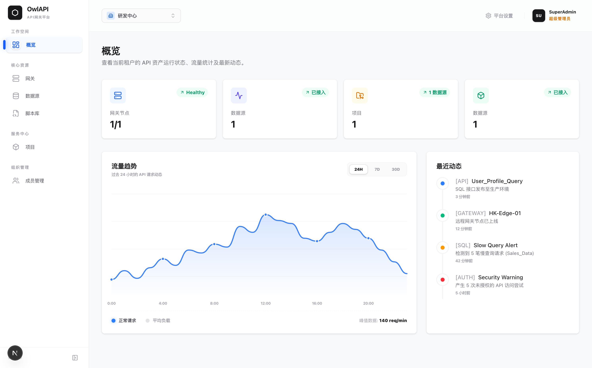
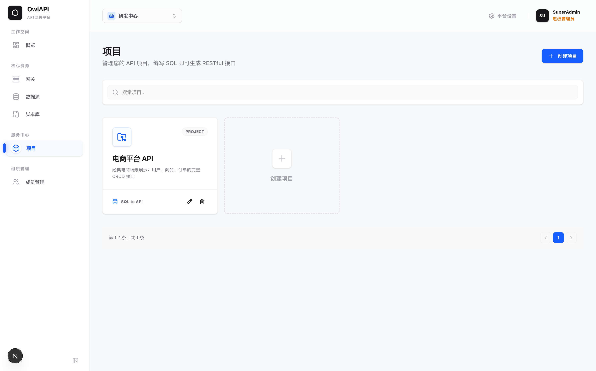

<div align="center">

#  OwlApi

**企业级 SQL to API 智能网关平台**

企业级混合云智能网关，打破内网物理边界，编写 SQL 即可一键生成高可用 RESTful API，全面释放孤岛数据价值。

[](https://go.dev/)
[](https://gin-gonic.com/)
[](https://nextjs.org/)
[](https://www.postgresql.org/)

[English](./README_EN.md) | 简体中文

[官网](https://owlapi.cn) |  [管理后台](https://admin.owlapi.cn) | [文档中心](https://docs.owlapi.cn)

<p>
  <a href="https://github.com/bulolo/owlapi">
    
  </a>
</p>

**如果这个项目对你有帮助，请点击右上角 ⭐ Star 支持一下，这是对开发者最大的鼓励！**

</div>

---

## 🚀 最近更新

### 2026-05-13 🗄️ 多数据库全面接入
- 🔌 **六类数据源支持**: 新增 MySQL、PostgreSQL、SQL Server、SQLite、StarRocks、Apache Doris 全面接入。
- 🖥️ **数据浏览器**: 可视化浏览远端数据库表结构与表数据，无需额外工具。
- 📋 **结构化连接表单**: 数据源配置告别手写 DSN，改为可视化字段填写。

### 2026-04-01 🌐 网关执行器演进
- 🛡️ **混合云架构**: 发布全新的架构大版本。Gateway 可直接部署在深层内网环境，主动向控制面建立 gRPC 反向隧道，彻底告别公网 IP 和复杂的白名单配置。
- ⚙️ **多租户隔离**: 上线 RBAC 体系（SuperAdmin / Admin / Viewer），实现多数据源、多项目的严格权限隔离。
- 📦 **参数推断重构**: 支持在 SQL 编写时动态识别 `:变量`，一键映射并暴露为标准的 HTTP 查询参数或 Body，极大提升了 API 生成的敏捷度。
- 📚 **官网全线升级**: [owlapi.cn](https://owlapi.cn) 官网焕新，全面适配企业级 UI 体验。

---

## 💡 使用场景

| 场景 | 描述 |
|------|------|
| 🏢 **企业内网数据开放** | 将深藏内网的 ERP、MES、WMS 等系统数据库，通过网关安全暴露为标准 REST API，供前端或第三方系统调用，无需改造原有系统。 |
| 📊 **报表与数据查询 API** | 运营、数据团队直接编写 SQL 即可生成报表查询接口，不再依赖后端排期，分钟级交付数据需求。 |
| 🔗 **跨系统数据集成** | 多套异构数据库（MySQL、SQL Server、PostgreSQL 等）统一接入，通过 API 层屏蔽底层差异，简化系统集成复杂度。 |
| 🚀 **快速原型与 MVP** | 跳过后端开发环节，基于现有数据库直接生成 CRUD 接口，快速验证业务想法。 |
| 🛡️ **数据库访问收口** | 以 API 网关替代直连数据库，统一鉴权、参数校验与访问审计，避免业务系统直接暴露数据库凭证。 |

---

## 🎯 项目亮点

- ✅ **开箱即用**: `make dev-up` 一键在本地拉起完整的全栈架构平台（Control Plane + Gateway + Database + Admin Console + Docs 共 6 大服务容器）。
- ✅ **物理级解耦**: 采用 Control Plane 与 Gateway 分离的架构设计，确保核心控制面与数据流转层的独立安全。
- ✅ **全数据库兼容**: 开箱支持 MySQL、PostgreSQL、SQL Server、SQLite、StarRocks、Apache Doris 六类数据源，统一驱动接入，跨越异构生态查询数据。
- ✅ **边缘端就绪**: Gateway 使用 Go 1.25 构建，单一二进制、内存占用极低，可稳定运行在树莓派、NAS 甚至软路由等资源受限的边缘设备上。
- ✅ **企业友好型 UI**: 前端控制台重构为 Next.js 16 APP Router 架构，结合 TailwindCSS 提供丝滑的桌面级管理体验。

---

## 📸 应用截图

<p align="center">
  
</p>
<p align="center">
  
</p>

---

## ✨ 核心特性

### 🎯 管理后台 (Control Plane)
- **📝 API 可视化编排**: 基于 SQL 的极速创建流程，支持自动推断 Query、Body 和 Path 参数。
- **👥 RBAC 权限管理**: 内置超级管理员（SuperAdmin）、管理员（Admin）、查看者（Viewer）三级角色体系，精细管控每个租户的资源访问范围。
- **🌐 项目隔离**: 按业务职能划分 Project，各项目的 API 端点与认证凭据完全独立，互不干扰。

### 🌐 执行网关 (Gateway)
- **🚀 零侵入部署**: 无需开放数据库防火墙端口，Gateway 主动向 Control Plane 发起 gRPC 长连接，彻底消除公网暴露风险。
- **⚡ 高并发承载**: 基于 Go 协程与连接池复用，支持高密度 HTTP-to-SQL 并发转换，低延迟响应。
- **🔒 数据不过控制面**: 查询指令由 Control Plane 下发，实际数据流仅在 Gateway 与数据库之间流转，敏感数据不经中转节点。

---

## 🏗️ 技术架构

### 后端技术栈 (Control Plane & Gateway)
- **核心框架**: Go 1.25+, Gin (HTTP API)
- **通信枢纽**: gRPC Server/Client (HTTP/2 反向长连接)
- **核心数据库**: PostgreSQL (pgx driver)
- **权限与认证**: JWT 体系分发校验
- **多数据库支持**: MySQL、PostgreSQL、SQL Server、SQLite、StarRocks、Apache Doris（驱动均已集成）

### 前端技术栈 (Admin & Web)
- **框架**: Next.js 16 (App Router 模式)
- **语言**: React 19 + TypeScript 5
- **视觉层**: Tailwind CSS 4 + Framer Motion (精美动效)
- **包管理**: pnpm / npm 

---

## 📁 项目结构

```
owlapi/
├── backend/                        # 🛡️ Go 语言核心后端（双引擎）
│   ├── cmd/
│   │   ├── server/                 # Control Plane (管控中枢启动入口)
│   │   ├── gateway/                 # Gateway (执行器启动入口)
│   │   └── init/                   # 预设数据挂载工具
│   ├── internal/
│   │   ├── domain/                 # 核心领域模型与接口定义
│   │   ├── service/                # 业务逻辑编排
│   │   ├── repo/postgres/          # 数据库访问层
│   │   ├── transport/              # 对外通信层 (Gin HTTP / gRPC)
│   │   └── gateway/                # ★ Gateway 连接管理与生命周期
│   └── proto/                      # gRPC Protobuf 描述文件
│
├── frontend/
│   ├── admin/                      # 🎯 管理控制台 (Next.js, 8001)
│   ├── website/                    # 🌐 官方 SaaS 网站 (Next.js, 8002)
│   └── docs/                       # 📚 VitePress 文档中心 (8003)
│
├── deploy/                         # 🚀 生产环境 Docker Compose 部署配置
├── docker-compose.dev.yml          # 一键拉起 6 大服务容器
└── Makefile                        # 项目管理与启动脚本 (自动化工具箱)
```

### 核心目录说明

| 目录 | 职责与能力 | 技术基底 |
|------|------|--------|
| `backend/cmd/server/` | Control Plane 主进程，提供租户管理、API 编排、鉴权及网关调度 | Go + Gin |
| `backend/cmd/gateway/` | 内网轻量级执行节点，接收 gRPC 下发的 SQL 指令并在本地数据库执行 | Go + Database Drivers |
| `frontend/admin/` | 管理控制台，涵盖租户管理、API 编排、网关配置等全部管理功能 | Next.js 16 |

---

## 🚀 安装与配置

### 前置要求

- **Docker** >= 20.10 & **Docker Compose** V2
- **Make** 工具
- **Go** >= 1.25（如需本地原生开发）
- **Node.js** >= 22（如需本地编译前端）

---

## ⚡ 快速开始 (3 分钟)

### 1. 克隆项目
```bash
git clone https://github.com/bulolo/owlapi.git
cd owlapi
```

### 2. 启动开发环境

适合在本地或服务器快速体验，前台输出所有容器日志，Ctrl+C 停止：
```bash
make dev-up
```

服务启动后可访问：
- 🎯 **Admin 控制台**: http://localhost:8001 `(租户管理员: admin@owlapi.cn / admin123)` 
- 📚 **文档中心**: http://localhost:8003
- 🚀 **RESTful API 服务**: http://localhost:3000
- 🐘 **PostgreSQL**: localhost:5433

---

## 🏗️ 项目管理 (Makefile)

本项目根目录提供了 `Makefile` 工具，将常用的构建、启动、清理等操作封装为单条命令，降低日常开发成本。

### 核心开发命令

| 命令 | 执行动作说明 |
|------|------|
| `make dev-up` | **启动全栈**：启动所有开发服务容器，前台输出聚合日志，Ctrl+C 停止但保留数据。 |
| `make dev-down` | **停止服务**：停止并移除所有容器，数据卷完整保留，下次启动继续使用。 |
| `make dev-clean` | **清空重置**：删除所有容器与数据卷（含 `postgres_data`），用于彻底重置开发环境（⚠️ 数据将清空）。 |

---

## ❓ 常见问题 (FAQ)

> [!TIP]
> 遇到环境异常时，依次执行 `make dev-clean` 和 `make dev-up` 可解决绝大多数问题。

**Q: 执行 SQL 时提示 `Connection timeout / gRPC failed`？**
A: 请检查 Gateway 容器日志，确认它是否能正常连通内网数据库，并核查启动配置中的 Control Plane 地址是否正确。

**Q: 想要扩展新的数据库适配器？**
A: 请在 `backend/internal/gateway/executor.go` 中的 `resolveDriver` 函数添加 DSN 识别逻辑，并引入对应的数据库驱动包即可。

---

## 📚 相关文档

深入了解网关配置与 API 规范，可参考以下文档：

- 📖 [部署实战手册](./frontend/docs/docs/guide/architecture.md)
- 🚀 [多租户与 RBAC 权限说明](./frontend/docs/docs/guide/multi-tenancy.md)
- 🔌 [关于 REST API 调用的说明](./frontend/docs/docs/api/rest.md)
- 🎯 [隧道通讯规范：gRPC](./frontend/docs/docs/api/grpc.md)

---

## 📄 许可证与商业用途 (License & Commercial Use)

本项目采用 **OwlApi 开源许可证 (基于 Apache 2.0 改进)**。在保留开源灵活性的同时，我们增加了必要的条款以保护项目品牌和商业权益。

### 📌 核心准则
1. **个人/企业内部使用**：完全免费，无需额外授权。
2. **所有场景必须保留品牌**：无论何种用途，均**严禁**移除或修改 UI、控制台及 API 响应头中的 "OwlApi" 标识或版权声明。
3. **严禁未经授权的 SaaS 服务**：未经 OwlApi 官方书面授权，禁止利用本项目源码提供营利性的多租户 SaaS 服务（如：提供在线 API 网关托管、SQL to API 订阅平台等）。

### ⚠️ 为什么有此限制？
我们希望将核心技术贡献给开源社区，同时防止“去品牌化”的商业剽窃行为。如需商业授权或有合作意向，请联系官方：[owlapi.cn](https://owlapi.cn)。

详见 [LICENSE](LICENSE) 获取完整文本。

### 🤔 为什么选择此许可证？

我们参考了业界优秀的开源商业授权模式，旨在提供比 AGPL-3.0 更灵活的企业友好性，同时通过限制多租户 SaaS 服务来确保项目的核心资产和品牌得到保护。

---

<div align="center">

## 📮 联系方式

**💬 问题反馈**: [GitHub Issues](https://github.com/bulolo/owlapi/issues) &nbsp; | &nbsp; **📧 商务合作**: support@owlapi.cn / bulolo (微信) &nbsp; | &nbsp; **🌐 官方网站**: [owlapi.cn](https://owlapi.cn)

<br>


<br>
<sub>扫码加入社区 (备注: OwlApi)</sub>

</div>

</div>

---

<div align="center">

**⭐ 如果这个项目对您有帮助，请给我们一个 Star！**

Made with ❤️ by OwlApi Team

</div>
