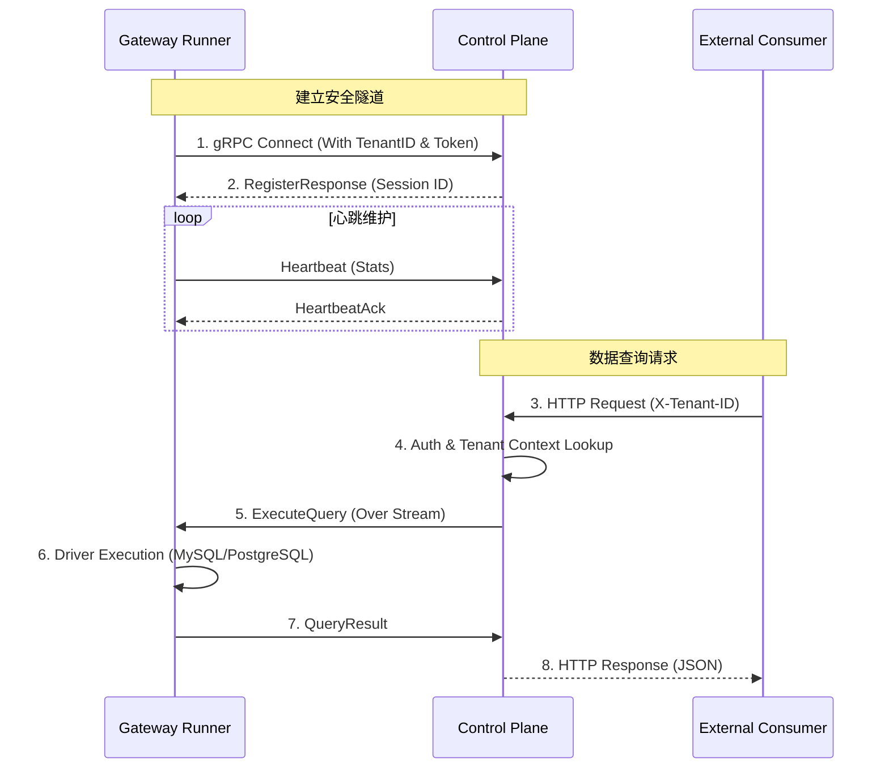

# OwlApi 后端架构设计

本文档详细描述了 OwlApi 后端（控制面与执行引擎）的内部架构设计与核心逻辑。

## 1. 总体概览

OwlApi 采用 **云端控制面 (Control Plane)** + **边缘执行节点 (Gateway Runner)** 的分布式架构。这种设计旨在解决跨网络环境的数据访问需求。

### 1.1 核心组件

- **Control Plane (Server)**:
    - 负责 API 的完整生命周期管理。
    - 处理用户鉴权、多租户隔离与权限校验。
    - 维护与所有 Gateway Runner 的长连接并进行任务分发。
- **Gateway Runner**:
    - 轻量级代理，部署在受防火墙保护的私有网络（IDC/VPC）。
    - 负责执行具体数据库查询。

## 2. 通信模型 (Communication Model)

### 2.1 反向隧道机制 (Reverse Tunneling)

> [!NOTE]
> 为了避免在用户内网开启公网端口，Gateway Runner 采用“主动连接”策略。

Gateway Runner 启动时会通过双向流（gRPC Bi-directional Stream）主动建立到 Control Plane 的连接。

### 2.2 协议栈 (Protocol Stack)
- **Transport**: gRPC over HTTP/2 (支持 TLS 1.3)
- **Serialization**: Protocol Buffers v3
- **Data Format**: 业务载荷采用 JSON (QueryResult) 以保证最大的灵活性。

## 3. 多租户设计 (Multi-Tenancy)

> [!IMPORTANT]
> OwlApi 原生支持多租户隔离，确保不同企业/团队之间的数据完全物理隔离。

### 3.1 隔离策略
- **数据层隔离**: 所有核心表均包含 `tenant_id` 复合主键，Query 语句强制包含租户过滤。
- **连接隔离**: gRPC 连接池基于 `tenant_id + runner_id` 进行索引，确保指令发送到属于该租户的节点。
- **路由隔离**: 执行路径 (`/api/v1/query/*`) 必须配合 `X-Tenant-ID` 请求头。

### 3.2 身份提取流程
1. **Runner 端**: 启动环境变量 `OWLAPI_TENANT_ID` 决定其归属。
2. **API 端**: 从请求头或 JWT 中提取租户 ID，并注入 `context.Context` 贯穿整个调用链。

## 4. 扩展性设计

### 4.1 SQL 执行驱动 (Executors)
Gateway Runner 内部采用插拔式驱动设计：
- `Mock`: 用于全链路联通性测试。
- `Generic SQL`: 基于 `database/sql` 支持主流关系型数据库。
